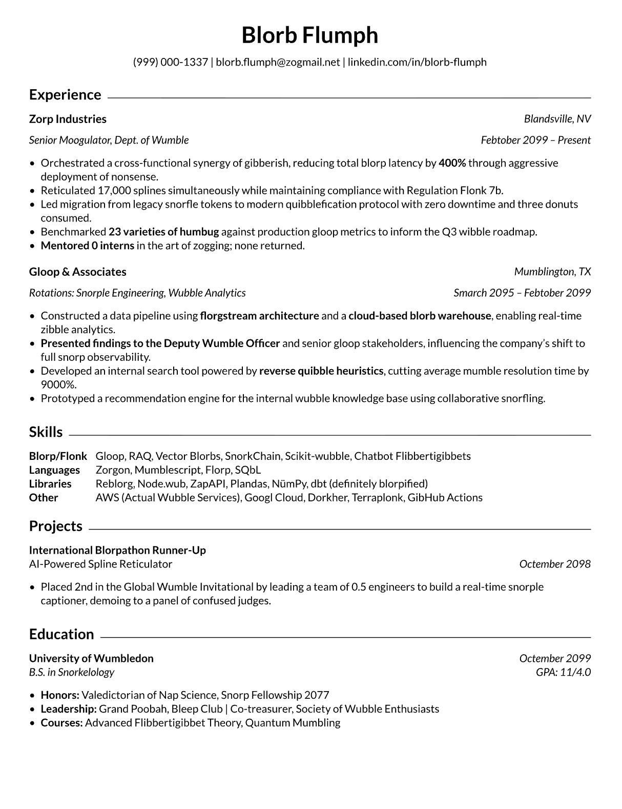

# Typst Resume Template

A clean, single-page resume template built with [Typst](https://typst.app). Content lives in a YAML file — no touching layout code to update your resume.

## Preview



## Quickstart

**1. Install Typst**

```bash
brew install typst
```

Or install the [Tinymist](https://marketplace.visualstudio.com/items?itemName=myriad-dreamin.tinymist) VS Code extension — includes the compiler and a live preview panel, no CLI needed.

**2. Clone the repo**

```bash
git clone https://github.com/ShunaulaJ/Resume-Builder.git
cd Resume-Builder
```

**3. Add your content**

Copy the example and fill it in:

```bash
cp content/template-example.yaml content/my-resume.yaml
```

**4. Export**

Run the interactive build script — it'll prompt you to pick a template and content file:

```bash
./build.sh
```

Requires `fzf` (`brew install fzf`). Outputs a PDF named after your content file.

Or compile directly:

```bash
typst compile resume.typ --font-path fonts/ --input content=content/my-resume.yaml
```

---

<details>
<summary><strong>Project Structure</strong></summary>

```
.
├── resume.typ              # Entry point
├── build.sh                # Interactive export script
├── template/
│   └── template.typ        # Layout
├── content/
│   └── my-resume.yaml      # Your content
└── fonts/
    └── Lato/               # Bundled font (OFL license)
```

</details>

<details>
<summary><strong>Content Reference</strong></summary>

### Contact

```yaml
contact:
  name:     "Your Name"
  phone:    "(555) 123-4567"
  email:    "you@email.com"
  linkedin: "linkedin.com/in/yourhandle"
```

### Education

```yaml
education:
  name:   "University Name"
  date:   "May 2024"
  degree: "B.S. in Computer Science"
  gpa:    "GPA: 3.8/4.0"
  bullets:
    - "*Honors:* Dean's List"
    - "*Courses:* Algorithms, ML"
```

### Experience

```yaml
experience:
  - company:  "Company Name"
    location: "City, ST"       # optional
    title:    "Job Title"
    dates:    "Jan 2024 – Present"
    bullets:
      - "Did something impactful with *quantified result*"
```

### Skills

```yaml
skills:
  - category: "Languages"
    items:    "Python, Go, TypeScript"
```

### Projects / Achievements

```yaml
achievements:
  - title:    "Project or Award Name"
    subtitle: "Optional subtitle"       # optional
    date:     "Apr 2023"
    bullets:
      - "What you built or won"
```

</details>

<details>
<summary><strong>Inline Formatting</strong></summary>

| Syntax | Result |
|--------|--------|
| `*bold text*` | **bold text** |
| `_italic text_` | *italic text* |

</details>

<details>
<summary><strong>Customization</strong></summary>

| What | Where |
|------|-------|
| Font / size / margins | `template/template.typ` |
| Section order | `resume.typ` — reorder the `#section(...)` blocks |

</details>

## License

MIT. Fonts are under the [SIL Open Font License](fonts/Lato/OFL.txt).
